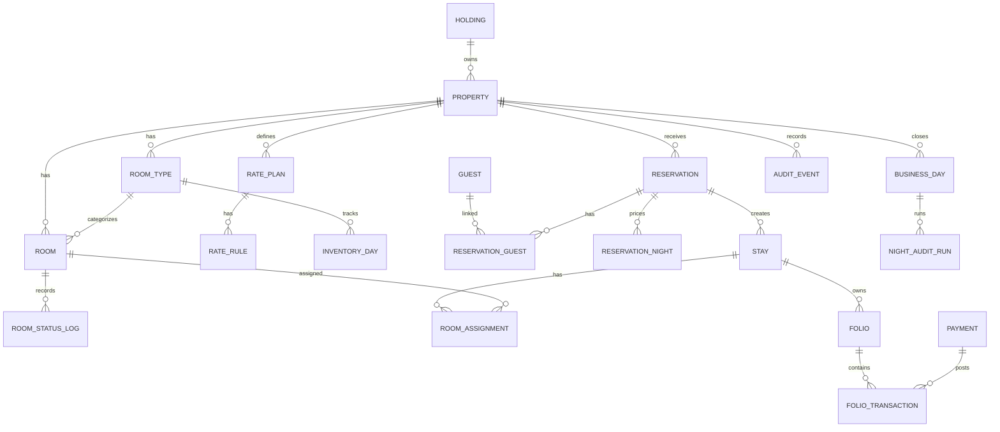

# ER Diagram

```mermaid
erDiagram
    HOLDING ||--o{ PROPERTY : owns
    PROPERTY ||--o{ ROOM_TYPE : has
    PROPERTY ||--o{ ROOM : has
    ROOM_TYPE ||--o{ ROOM : categorizes
    PROPERTY ||--o{ RATE_PLAN : defines
    RATE_PLAN ||--o{ RATE_RULE : has
    ROOM_TYPE ||--o{ INVENTORY_DAY : tracks
    ROOM ||--o{ ROOM_STATUS_LOG : records

    GUEST ||--o{ RESERVATION_GUEST : linked
    RESERVATION ||--o{ RESERVATION_GUEST : has
    PROPERTY ||--o{ RESERVATION : receives
    RESERVATION ||--o{ RESERVATION_NIGHT : prices
    RESERVATION ||--o{ STAY : creates

    STAY ||--o{ ROOM_ASSIGNMENT : has
    ROOM ||--o{ ROOM_ASSIGNMENT : assigned
    STAY ||--o{ FOLIO : owns
    FOLIO ||--o{ FOLIO_TRANSACTION : contains
    PAYMENT ||--o{ FOLIO_TRANSACTION : posts

    PROPERTY ||--o{ BUSINESS_DAY : closes
    BUSINESS_DAY ||--o{ NIGHT_AUDIT_RUN : runs
    PROPERTY ||--o{ AUDIT_EVENT : records
```
